# Stakeholder Persona Analysis

## 1. Primary Stakeholder Categories
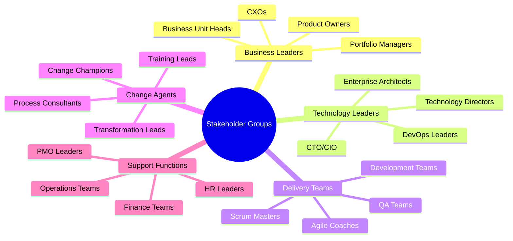

## 2. Key Persona Details

### Business Leader Personas

#### 1. Strategic Steve (CXO)
```yaml
Primary Concerns:
- Business value & ROI
- Market competitiveness
- Innovation pace
- Risk management

Needs:
- Clear value proposition
- Strategic alignment
- Measurable outcomes
- Risk mitigation strategies

Pain Points:
- Slow transformation pace
- Unclear ROI
- Resource constraints
- Change resistance
```

#### 2. Portfolio Paula (Business Unit Head)
```yaml
Primary Concerns:
- Portfolio performance
- Resource optimization
- Delivery predictability
- Customer satisfaction

Needs:
- Portfolio visibility
- Resource planning
- Value stream optimization
- Customer insights

Pain Points:
- Delivery delays
- Resource conflicts
- Unclear priorities
- Budget constraints
```

### Technology Leader Personas

#### 3. Tech Tom (CTO/CIO)
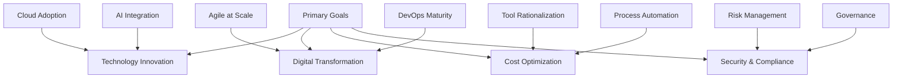

#### 4. Architecture Anna (Enterprise Architect)
```yaml
Primary Concerns:
- Technical debt
- Architecture standards
- Integration patterns
- Technology roadmap

Needs:
- Architecture frameworks
- Integration guidelines
- Technology standards
- Innovation opportunities

Pain Points:
- Legacy systems
- Integration complexity
- Standard adherence
- Technology gaps
```

### Delivery Team Personas

#### 5. Coach Charlie (Agile Coach)
```yaml
Primary Concerns:
- Team maturity
- Process improvement
- Cultural change
- Best practices

Needs:
- Coaching frameworks
- Assessment tools
- Training materials
- Success metrics

Pain Points:
- Resistance to change
- Inconsistent practices
- Limited engagement
- Scaling challenges
```

## 3. Influence vs Interest Matrix
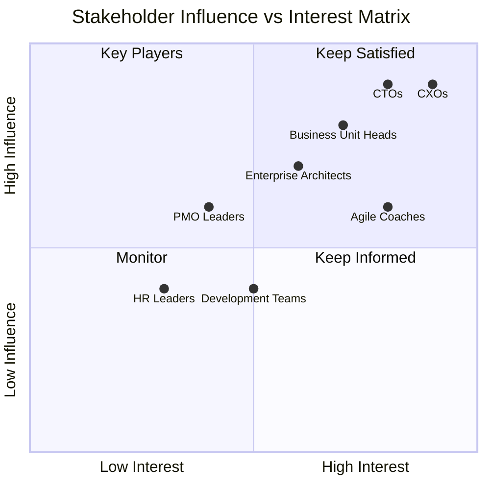

## 4. Engagement Strategy

### High Influence - High Interest (Key Players)
```yaml
Stakeholders:
- CXOs
- CTOs
- Business Unit Heads

Engagement Approach:
- Regular executive briefings
- Strategic planning sessions
- Value realization reviews
- Risk mitigation updates
```

### High Influence - Low Interest (Keep Satisfied)
```yaml
Stakeholders:
- Finance Leaders
- HR Leaders
- Operations Heads

Engagement Approach:
- Monthly status updates
- Impact assessments
- Resource planning reviews
- Compliance updates
```

I'll create detailed journey maps for key stakeholders focusing on their experience with our Business Agility offerings.

# Stakeholder Journey Maps

## 1. CXO Journey (Strategic Steve)
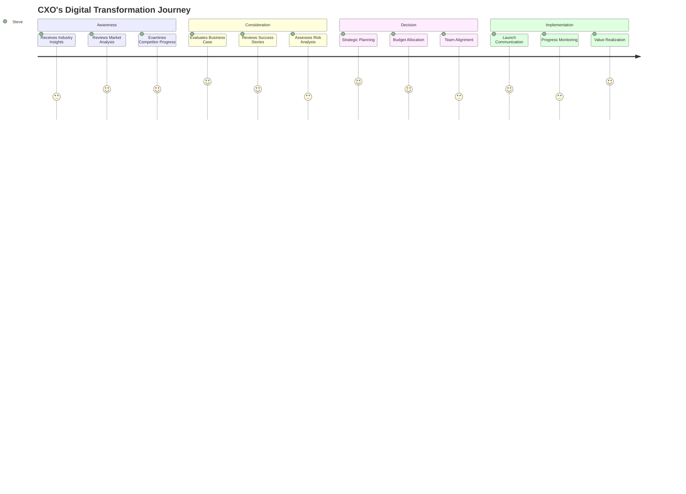

### Detailed Touchpoints & Emotions
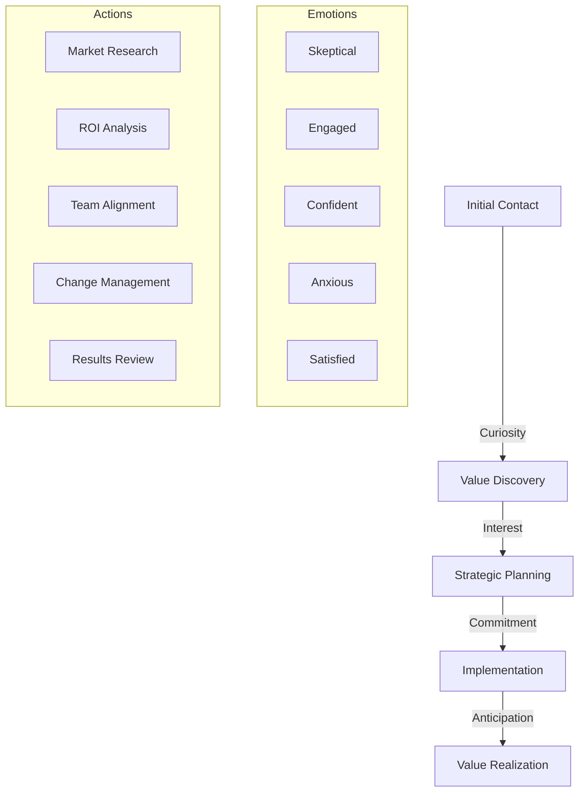

## 2. Technology Leader Journey (Tech Tom)
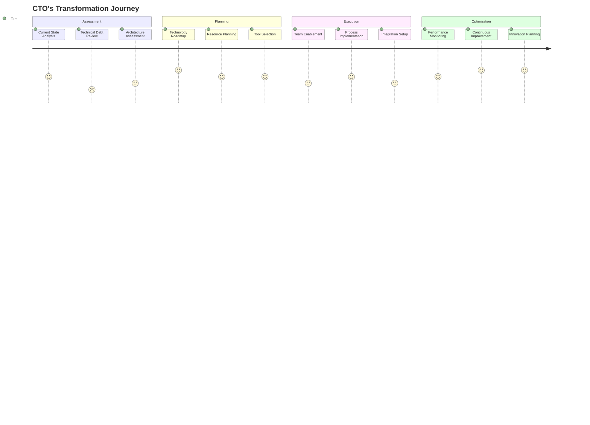

### Implementation Phases & Concerns
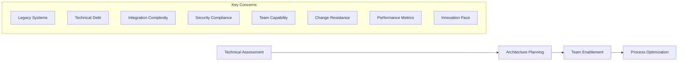

## 3. Agile Coach Journey (Coach Charlie)
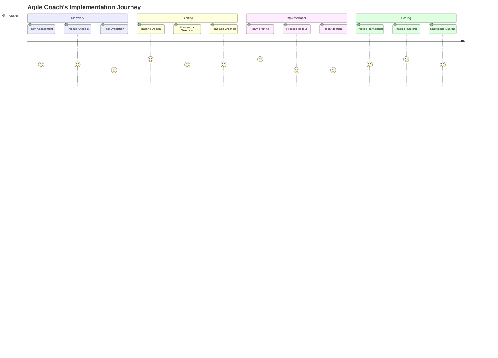

### Coaching Intervention Points
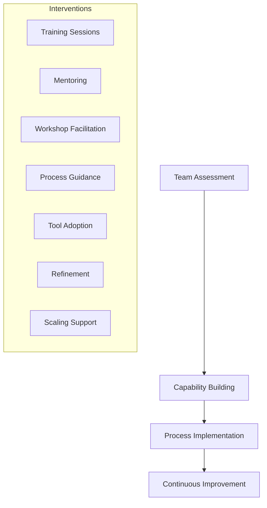

## 4. Business Unit Head Journey (Portfolio Paula)
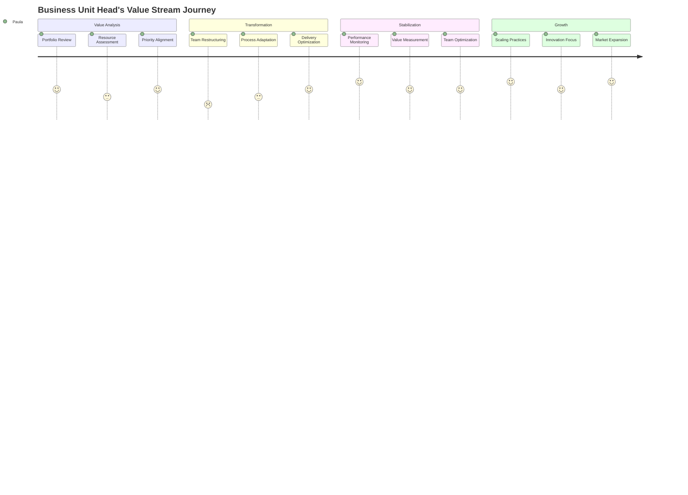

### Value Stream Evolution
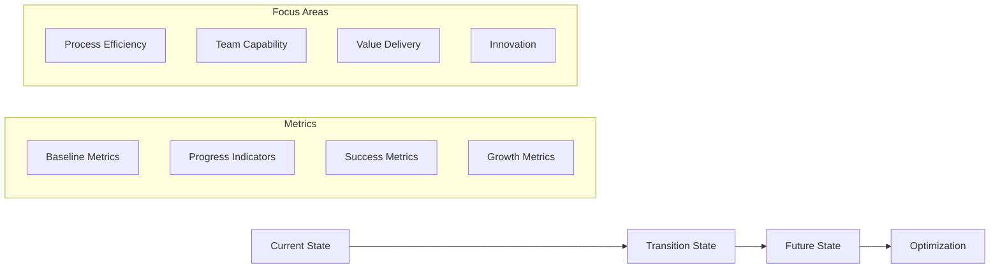

## 5. Common Pain Points & Solutions Matrix
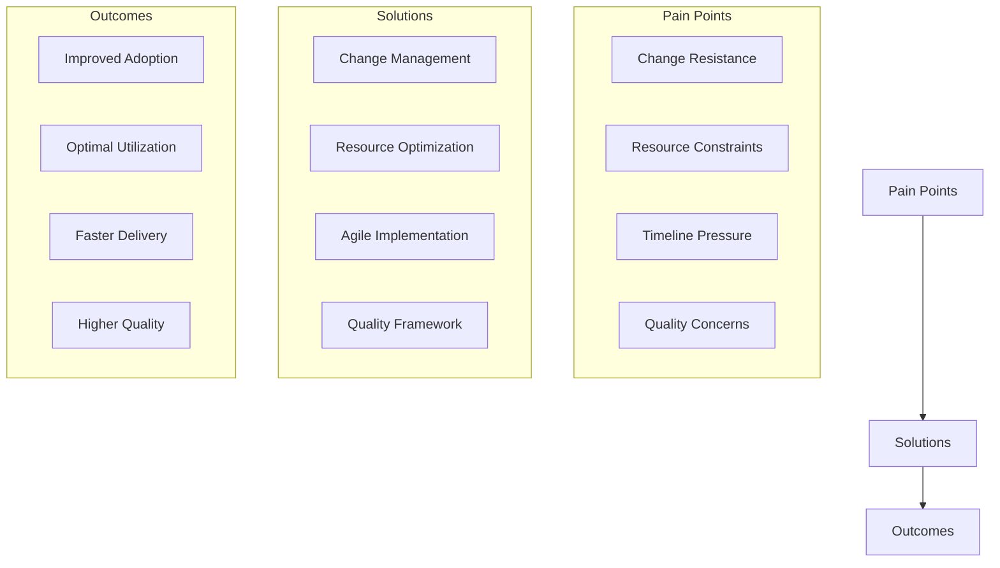

