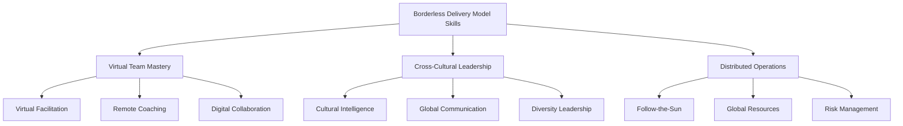
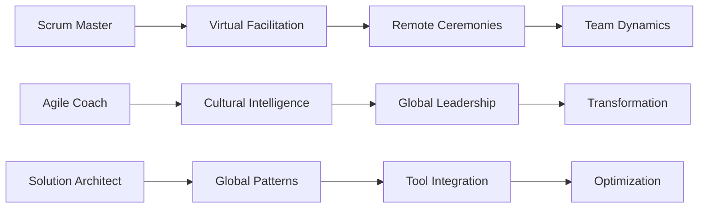
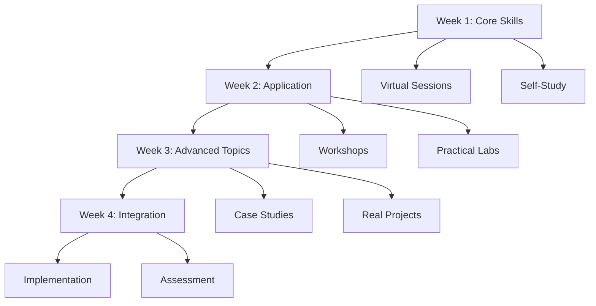
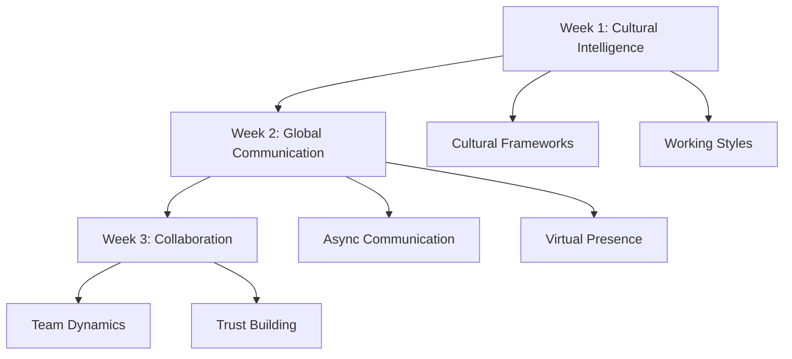
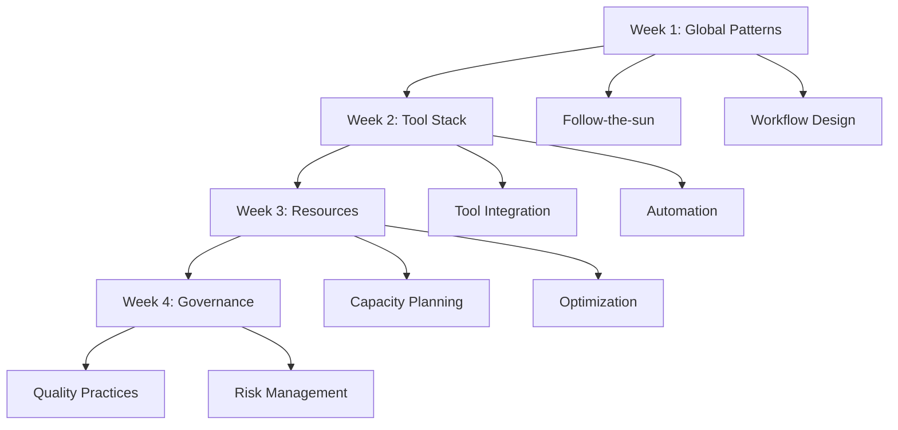
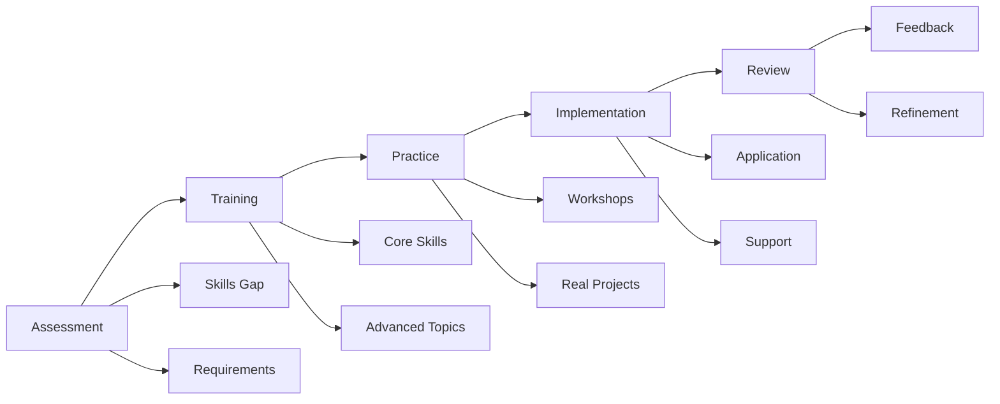
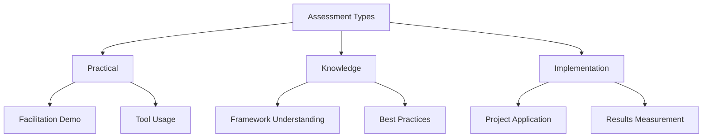
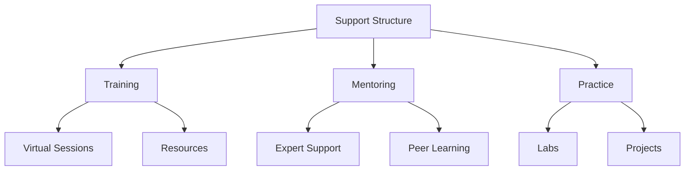

# Borderless Delivery Model Enablement

## Specialized Skills Framework

## Role-Based Learning Paths

## Program Structure

## Focused Programs

### 1. Virtual Team Excellence (2 weeks)
For: Scrum Masters & Agile Coaches

#### Week 1: Virtual Facilitation
- Virtual facilitation techniques
- Digital collaboration tools
- Remote ceremonies
- Engagement patterns

#### Week 2: Team Dynamics
- Virtual team building
- Remote conflict resolution
- Distributed motivation
- Virtual coaching

### 2. Cross-Cultural Leadership (3 weeks)
For: Agile Coaches & Solution Architects

### 3. Distributed Operations (4 weeks)
For: Solution Architects & Senior Scrum Masters

## Implementation Roadmap

## Assessment Framework

## Success Metrics

### Individual Level
- Facilitation effectiveness
- Cultural adaptation
- Tool proficiency
- Team feedback

### Program Level
- Delivery efficiency
- Team satisfaction
- Communication effectiveness
- Implementation success

## Support Structure

## Calendar Q1 2024

| Program | Dates | Duration |
|---------|-------|-----------|
| Virtual Team Excellence | Jan 8-19 | 2 weeks |
| Cross-Cultural Leadership | Feb 5-23 | 3 weeks |
| Distributed Operations | Mar 4-29 | 4 weeks |

## Prerequisites & Outcomes

### Prerequisites
- 3+ years agile experience
- Active distributed team role
- Project involvement

### Expected Outcomes
- Advanced virtual facilitation
- Cross-cultural effectiveness
- Distributed delivery expertise

For detailed implementation guides and resources, see: [[Borderless Delivery Model ‐ Implementation Guide & Resources]]