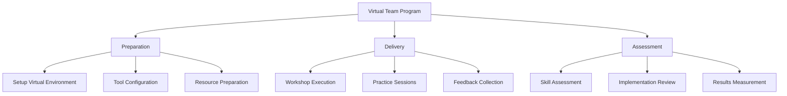

# Borderless Delivery Model - Implementation Guide & Resources

## Program Setup & Execution Guide

### 1. Virtual Team Excellence Program



#### Week 1: Virtual Facilitation Mastery

##### Session Plans

1. **Virtual Facilitation Fundamentals (Day 1-2)**
   ```markdown
   Time: 3 hours per day
   Format: Interactive Workshop
   Tools Required:
   - Miro/Mural for collaboration
   - Zoom/Teams for delivery
   - Mentimeter for engagement
   
   Activities:
   1. Virtual Ice-breakers (30 mins)
   2. Tool Mastery Workshop (60 mins)
   3. Practice Sessions (60 mins)
   4. Feedback & Discussion (30 mins)
   ```

2. **Advanced Digital Collaboration (Day 3-4)**
   ```markdown
   Time: 3 hours per day
   Format: Hands-on Lab
   Tools Required:
   - Collaboration tool stack
   - Virtual whiteboard
   - Team spaces
   
   Activities:
   1. Tool Stack Overview (45 mins)
   2. Hands-on Practice (90 mins)
   3. Integration Techniques (45 mins)
   ```

3. **Remote Ceremony Optimization (Day 5)**
   ```markdown
   Time: 4 hours
   Format: Practical Workshop
   Deliverables:
   - Ceremony templates
   - Facilitation guides
   - Tool configurations
   ```

#### Week 2: Remote Team Dynamics

##### Workshop Resources

1. **Virtual Team Building Templates**
   ```markdown
   - Quick start icebreakers
   - Team engagement activities
   - Virtual retrospective formats
   - Remote planning techniques
   ```

2. **Facilitation Guides**
   ```markdown
   - Virtual meeting structures
   - Engagement patterns
   - Time zone management
   - Participation techniques
   ```

3. **Assessment Checklists**
   ```markdown
   - Virtual facilitation skills
   - Tool proficiency
   - Ceremony effectiveness
   - Team engagement
   ```

### 2. Cross-Cultural Leadership Program

#### Week 1-3: Program Resources

##### Cultural Intelligence Framework
```markdown
1. Assessment Tools
   - Cultural awareness checklist
   - Communication style assessment
   - Leadership approach evaluation
   
2. Workshop Materials
   - Cultural dimension guides
   - Case study templates
   - Scenario exercises
   
3. Implementation Tools
   - Team agreement templates
   - Communication protocols
   - Decision-making frameworks
```

##### Practice Resources
```markdown
1. Simulation Scenarios
   - Cross-cultural meetings
   - Conflict resolution
   - Decision-making scenarios
   
2. Assessment Tools
   - Leadership effectiveness
   - Communication clarity
   - Team satisfaction
```

### 3. Distributed Operations Program

#### Implementation Toolkit

##### Tool Stack Configuration
```markdown
1. Collaboration Platform Setup
   - Access management
   - Integration points
   - Security protocols
   
2. Workflow Templates
   - Handoff procedures
   - Status tracking
   - Progress visualization
   
3. Documentation Standards
   - Knowledge base structure
   - Update protocols
   - Access patterns
```

##### Resource Management Tools
```markdown
1. Capacity Planning
   - Team allocation matrix
   - Skills distribution map
   - Coverage templates
   
2. Performance Tracking
   - Metrics dashboard
   - Progress visualization
   - Impact assessment
```

## Program Delivery Resources

### 1. Workshop Materials

#### Virtual Facilitation Kit
```markdown
1. Session Templates
   - Meeting structures
   - Activity guides
   - Time management
   
2. Tool Guides
   - Platform setup
   - Integration steps
   - Best practices
   
3. Engagement Patterns
   - Participation techniques
   - Energy management
   - Focus maintenance
```

#### Cross-Cultural Resources
```markdown
1. Communication Templates
   - Message structures
   - Update formats
   - Feedback patterns
   
2. Team Agreements
   - Working principles
   - Communication norms
   - Decision protocols
```

### 2. Assessment Tools

#### Skill Evaluation
```markdown
1. Competency Matrix
   - Technical skills
   - Soft skills
   - Leadership capabilities
   
2. Progress Tracking
   - Milestone checklist
   - Impact assessment
   - Feedback collection
```

#### Implementation Measurement
```markdown
1. Success Metrics
   - Team effectiveness
   - Delivery efficiency
   - Satisfaction scores
   
2. ROI Calculation
   - Time savings
   - Quality improvements
   - Cost optimization
```

## Support Infrastructure

### 1. Learning Environment
```markdown
1. Virtual Platform
   - Session recordings
   - Resource library
   - Practice space
   
2. Collaboration Tools
   - Team workspace
   - Knowledge base
   - Communication channels
```

### 2. Mentoring Structure
```markdown
1. Expert Support
   - Office hours
   - Review sessions
   - Feedback meetings
   
2. Peer Learning
   - Practice groups
   - Experience sharing
   - Case discussions
```

## Quality Assurance

### 1. Program Monitoring
```markdown
1. Quality Checks
   - Session effectiveness
   - Learning outcomes
   - Implementation success
   
2. Improvement Process
   - Feedback analysis
   - Program updates
   - Content refinement
```

### 2. Success Tracking
```markdown
1. Metrics Dashboard
   - Participation rates
   - Completion status
   - Implementation progress
   
2. Impact Assessment
   - Skill application
   - Business outcomes
   - Team effectiveness
```

## Additional Resources

### 1. Reference Materials
```markdown
1. Best Practices Guide
   - Virtual facilitation
   - Cultural integration
   - Distributed operations
   
2. Tool Documentation
   - Setup guides
   - Configuration steps
   - Integration patterns
```

### 2. Templates Library
```markdown
1. Session Templates
   - Workshop structures
   - Activity guides
   - Assessment forms
   
2. Implementation Templates
   - Project plans
   - Progress tracking
   - Review formats
```