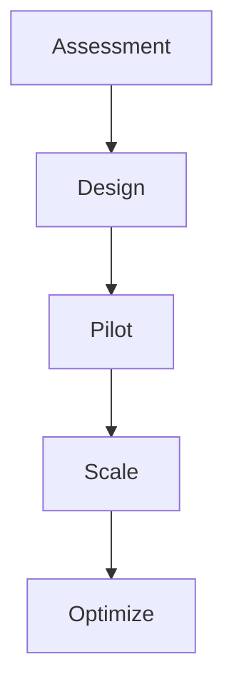
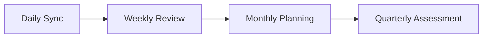

# Borderless Delivery Model
## Implementation Framework & Guidelines

### Assessment Framework

#### 1. Delivery Maturity Assessment
- Team Structure Evaluation
- Communication Pattern Analysis
- Tool Utilization Review
- Knowledge Management Assessment
- Cultural Integration Readiness

#### 2. Implementation Domains

**Team Structure & Governance**
- Virtual Team Models
- Roles & Responsibilities
- Decision-Making Framework
- Escalation Protocols

**Resource Management**
- Capacity Planning
- Skills Matrix
- Allocation Strategy
- Backup Planning

**Communication & Collaboration**
- Synchronous/Asynchronous Protocols
- Meeting Cadence
- Documentation Standards
- Tool Selection Criteria

**Cultural Integration**
- Awareness Programs
- Leadership Alignment
- Team Building Activities
- Success Metrics

### Process Frameworks

#### 1. Team Integration Process

#### 2. Communication Framework

### Implementation Templates

#### 1. Team Structure Template
| Role | Primary Location | Backup Location | Time Zone | Key Responsibilities |
|------|-----------------|-----------------|-----------|---------------------|
| Lead | | | | |
| Developer | | | | |
| QA | | | | |

#### 2. Communication Matrix
| Type | Frequency | Participants | Format | Tools |
|------|-----------|--------------|---------|-------|
| Daily Standup | | | | |
| Sprint Planning | | | | |
| Retrospective | | | | |

### Success Metrics Framework

#### 1. Delivery Metrics
- Cycle Time
- Lead Time
- Defect Rate
- Customer Satisfaction

#### 2. Team Metrics
- Collaboration Index
- Knowledge Sharing Rate
- Cultural Integration Score
- Team Satisfaction

### Tool Configuration Guidelines

#### 1. Collaboration Tools
- Standard Configurations
- Integration Points
- Access Management
- Backup Procedures

#### 2. Project Management Tools
- Workflow Setup
- Dashboard Configuration
- Reporting Templates
- Integration Framework

### Training Materials

#### 1. Role-Based Training Modules
- Team Lead Training
- Developer Guidelines
- QA Procedures
- Support Staff Training

#### 2. Cultural Integration Training
- Cross-cultural Communication
- Virtual Team Management
- Conflict Resolution
- Feedback Mechanisms

### Implementation Roadmap

#### Phase 1: Foundation (Weeks 1-4)
- Assessment Completion
- Tool Setup
- Initial Training
- Pilot Team Selection

#### Phase 2: Implementation (Weeks 5-12)
- Process Rollout
- Team Integration
- Monitoring Setup
- Initial Optimization

#### Phase 3: Optimization (Weeks 13-24)
- Performance Analysis
- Process Refinement
- Advanced Training
- Scale Planning

### Client Journey Map

#### 1. Discovery Phase
- Initial Assessment
- Solution Design
- ROI Projection
- Implementation Planning

#### 2. Implementation Phase
- Tool Setup
- Process Integration
- Team Training
- Initial Operations

#### 3. Optimization Phase
- Performance Analysis
- Process Refinement
- Continuous Improvement
- Success Measurement

### Persona-Based Guidelines

#### 1. Delivery Lead
- Team Structure Setup
- Performance Monitoring
- Resource Optimization
- Stakeholder Management

#### 2. Team Member
- Communication Protocols
- Tool Usage
- Knowledge Sharing
- Cultural Integration

#### 3. Stakeholder
- Progress Visibility
- Decision Framework
- Escalation Process
- Success Metrics

### Risk Mitigation Framework

#### 1. Communication Risks
- Identification Criteria
- Prevention Measures
- Resolution Steps
- Escalation Path

#### 2. Delivery Risks
- Early Warning Signs
- Mitigation Strategies
- Recovery Plans
- Lesson Learning Process

For detailed implementation support, contact: [Implementation Support Team]