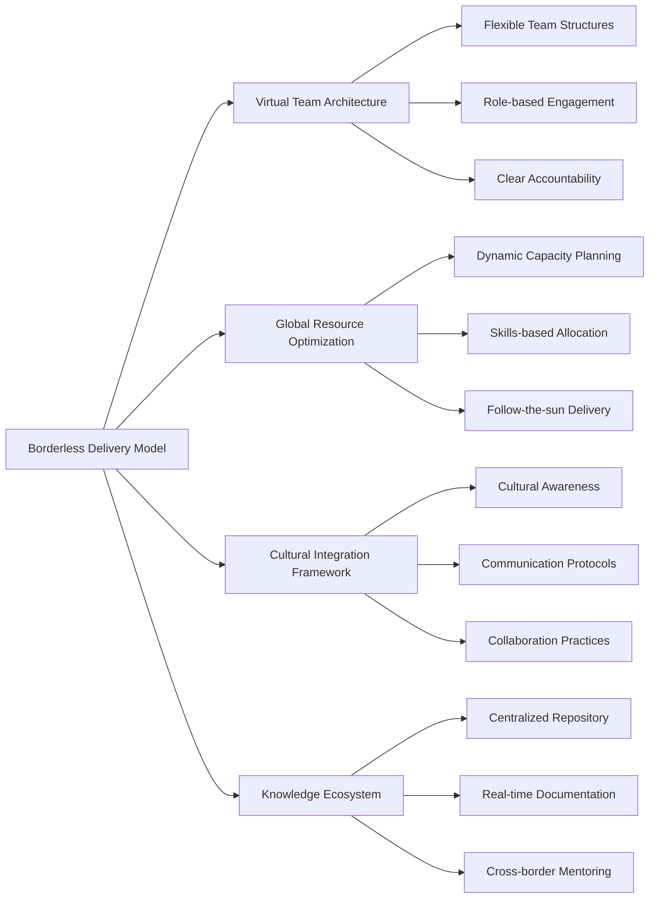
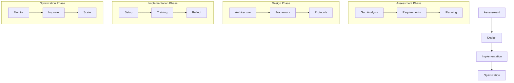
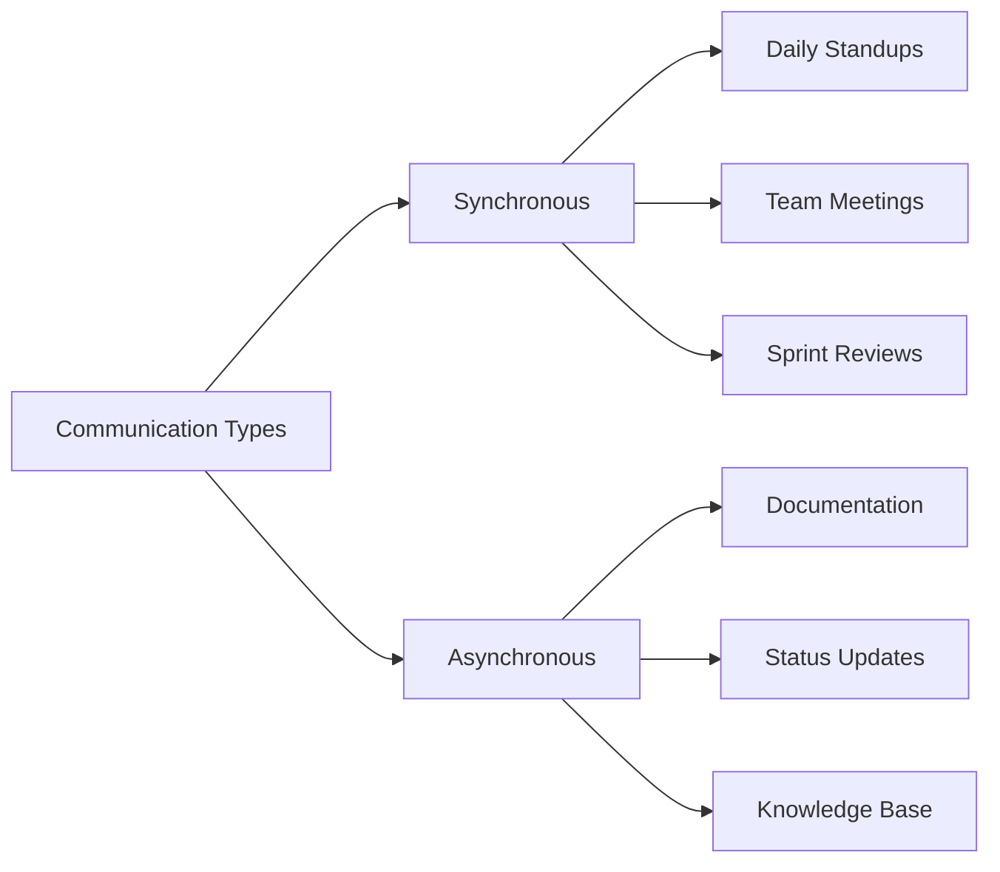
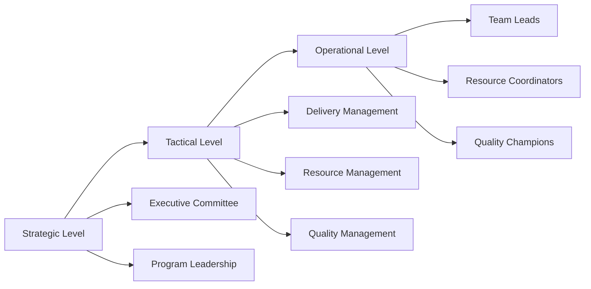
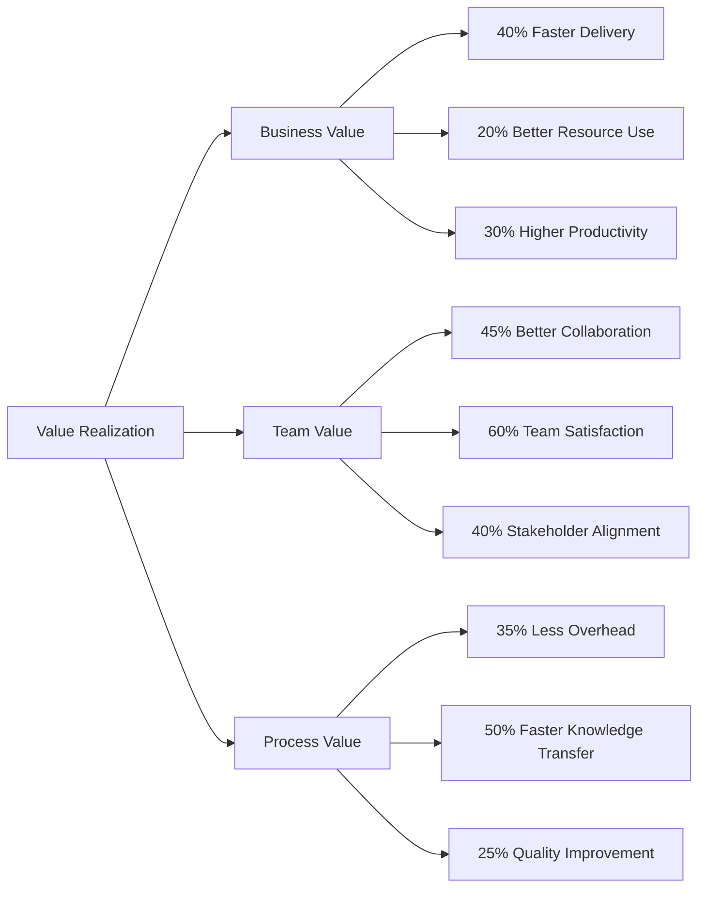
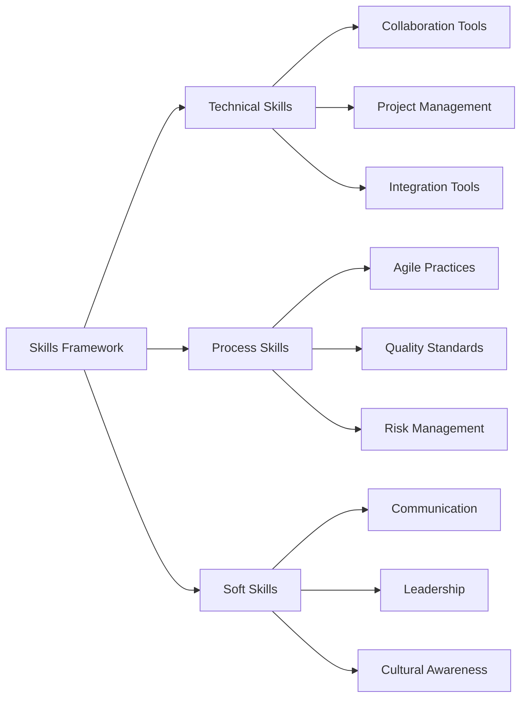

# Borderless Delivery Model

## Model Overview

```mermaid
flowchart LR
    BDM[Borderless Delivery Model] --> VTA[Virtual Team Architecture]
    BDM --> GRO[Global Resource Optimization]
    BDM --> CIF[Cultural Integration Framework]
    BDM --> KE[Knowledge Ecosystem]
    
    VTA --> VTA1[Flexible Team Structures]
    VTA --> VTA2[Role-based Engagement]
    VTA --> VTA3[Clear Accountability]
    
    GRO --> GRO1[Dynamic Capacity Planning]
    GRO --> GRO2[Skills-based Allocation]
    GRO --> GRO3[Follow-the-sun Delivery]
    
    CIF --> CIF1[Cultural Awareness]
    CIF --> CIF2[Communication Protocols]
    CIF --> CIF3[Collaboration Practices]
    
    KE --> KE1[Centralized Repository]
    KE --> KE2[Real-time Documentation]
    KE --> KE3[Cross-border Mentoring]
```

## Implementation Process

```mermaid
flowchart TD

    A[Assessment] --> B[Design]
    B --> C[Implementation]
    C --> D[Optimization]
    
    subgraph Assessment Phase
    A1[Gap Analysis] --> A2[Requirements]
    A2 --> A3[Planning]
    end

    subgraph Design Phase
    B1[Architecture] --> B2[Framework]
    B2 --> B3[Protocols]
    end
    
    subgraph Implementation Phase
    C1[Setup] --> C2[Training]
    C2 --> C3[Rollout]
    end
    
    subgraph Optimization Phase
    D1[Monitor] --> D2[Improve]
    D2 --> D3[Scale]
    end

    
```

## Communication Framework

```mermaid
flowchart LR
    COM[Communication Types] --> SYNC[Synchronous]
    COM --> ASYNC[Asynchronous]
    
    SYNC --> S1[Daily Standups]
    SYNC --> S2[Team Meetings]
    SYNC --> S3[Sprint Reviews]
    
    ASYNC --> A1[Documentation]
    ASYNC --> A2[Status Updates]
    ASYNC --> A3[Knowledge Base]
```

## Governance Structure

```mermaid
flowchart LR
    SL[Strategic Level] --> TL[Tactical Level]
    TL --> OL[Operational Level]
    
    SL --> SL1[Executive Committee]
    SL --> SL2[Program Leadership]
    
    TL --> TL1[Delivery Management]
    TL --> TL2[Resource Management]
    TL --> TL3[Quality Management]
    
    OL --> OL1[Team Leads]
    OL --> OL2[Resource Coordinators]
    OL --> OL3[Quality Champions]
```

## Value Realization Matrix

```mermaid
flowchart LR
    VR[Value Realization] --> BV[Business Value]
    VR --> TV[Team Value]
    VR --> PV[Process Value]
    
    BV --> BV1[40% Faster Delivery]
    BV --> BV2[20% Better Resource Use]
    BV --> BV3[30% Higher Productivity]
    
    TV --> TV1[45% Better Collaboration]
    TV --> TV2[60% Team Satisfaction]
    TV --> TV3[40% Stakeholder Alignment]
    
    PV --> PV1[35% Less Overhead]
    PV --> PV2[50% Faster Knowledge Transfer]
    PV --> PV3[25% Quality Improvement]
```

## Skills Framework

```mermaid
flowchart LR
    SF[Skills Framework] --> TS[Technical Skills]
    SF --> PS[Process Skills]
    SF --> SS[Soft Skills]
    
    TS --> TS1[Collaboration Tools]
    TS --> TS2[Project Management]
    TS --> TS3[Integration Tools]
    
    PS --> PS1[Agile Practices]
    PS --> PS2[Quality Standards]
    PS --> PS3[Risk Management]
    
    SS --> SS1[Communication]
    SS --> SS2[Leadership]
    SS --> SS3[Cultural Awareness]
```