## 1. BizDevOps Operating Model
**Purpose**: Integrate business and IT operations for seamless flow and swift market response

### Key Components:
1. **Integration Framework**
   - Business-IT alignment
   - Process harmonization
   - Value stream mapping
   - Workflow optimization

2. **Delivery Framework**
   - Continuous planning
   - Automated delivery pipelines
   - Quality gates
   - Feedback loops

3. **Benefits**:
   - ~25% Increased operational efficiency
   - ~15% Enhanced revenue growth
   - ~30% Improved resource utilization

## 2. Borderless Delivery Model
**Purpose**: Seamless integration of cross-border teams for maximum efficiency

### Key Components:
1. **Delivery Structure**
   - Virtual team framework
   - Global resource optimization
   - Location-independent collaboration
   - Knowledge sharing protocols

2. **Operating Framework**
   - Communication protocols
   - Governance model
   - Performance metrics
   - Quality controls

3. **Benefits**:
   - ~40% Reduction in delivery time
   - ~20% Resource utilization improvement
   - ~30% Global productivity increase

## 3. Intelligent Accountability Framework
**Purpose**: Enhance transparency and precision using GenAI-enhanced change tools

### Key Components:
1. **Accountability Structure**
   - Role definitions
   - Responsibility matrices
   - Decision frameworks
   - Performance tracking

2. **Intelligence Layer**
   - GenAI-powered analytics
   - Predictive insights
   - Automated reporting
   - Risk identification

3. **Benefits**:
   - ~40% reduction in decision cycle times
   - ~30% risk reduction
   - ~70% improvement in Governance Transparency

## 4. Continuous Improvement Accelerator
**Purpose**: Optimize product ideation to deployment workflow

### Key Components:
1. **Improvement Framework**
   - Process optimization
   - Resource allocation
   - Cost optimization
   - Quality enhancement

2. **Acceleration Mechanisms**
   - Automated workflows
   - Process diagnostics
   - Risk mitigation
   - Performance optimization

3. **Benefits**:
   - ~35% Reduction in delivery disruptions
   - ~20% Reduction in operational costs
   - ~25% Improvement in delivery times

## 5. Meaningful Reinvention Framework
**Purpose**: Align people, processes, and tools for exceptional customer value

### Key Components:
1. **Transformation Structure**
   - Change management
   - Cultural transformation
   - Process reengineering
   - Technology modernization

2. **Implementation Framework**
   - Assessment tools
   - Roadmap creation
   - Success metrics
   - Value realization

3. **Benefits**:
   - Enhanced organizational adaptability
   - Improved customer satisfaction
   - Accelerated transformation
   - Sustainable change

## Implementation Approach for All Offerings

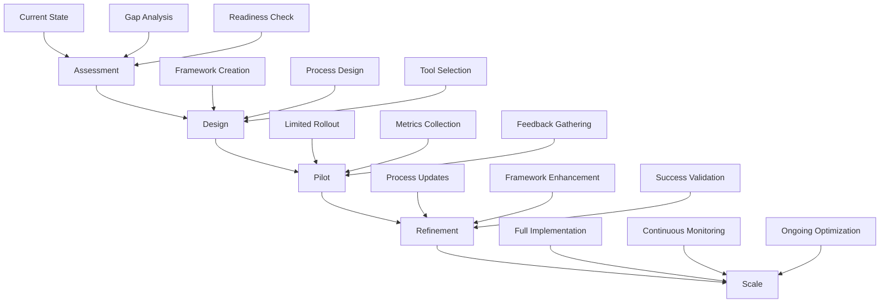

## Integration Points Between Offerings

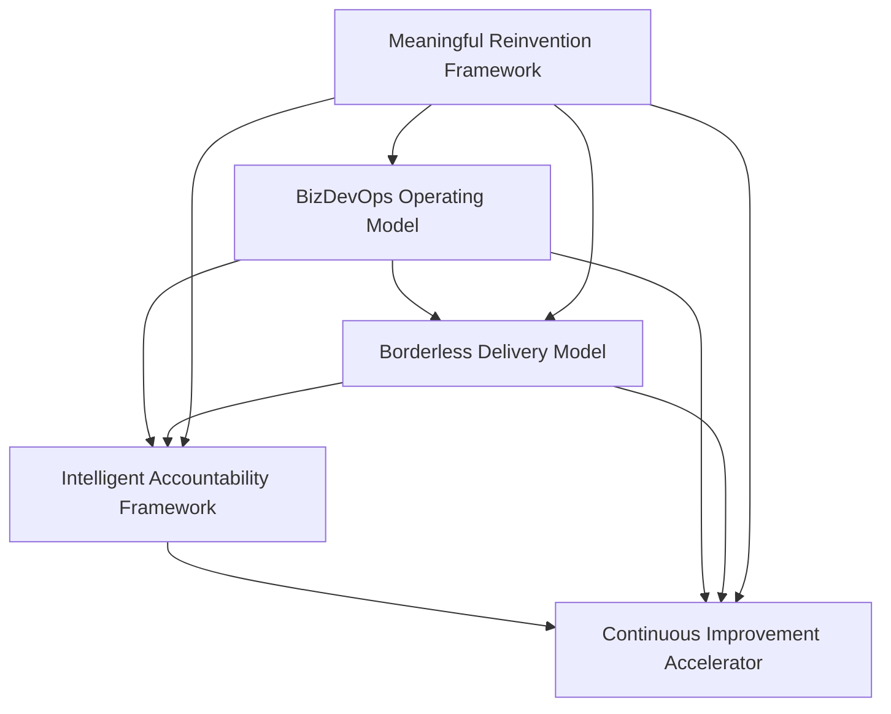

For each offering:
1. **Stage 0 Content**:
   - Value proposition
   - High-level framework
   - Benefits and ROI
   - Case studies
   - Market positioning

2. **Stage 1 Content**:
   - Detailed implementation guide
   - Assessment templates
   - Process frameworks
   - Training materials
   - Tool configurations
   - Success metrics

3. **Delivery Assets**:
   - Implementation templates
   - Checklists and guidelines
   - Metric dashboards
   - Status reports
   - Review frameworks


# Offering 1: BizDevOps Operating Model
## Enabling Assets Framework

### 1. Learning Path Structure
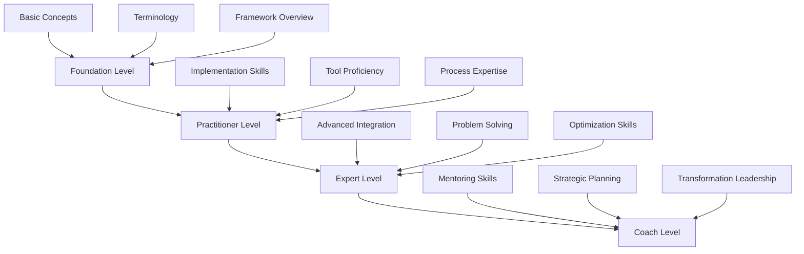

### 2. Training Components
- **Foundation Modules**
  - BizDevOps Fundamentals
  - Integration Principles
  - Value Stream Concepts
  - Basic Tools Training

- **Advanced Modules**
  - Implementation Strategies
  - Integration Patterns
  - Metrics & Measurements
  - Advanced Problem Solving

- **Certification Path**
  - Level 1: BizDevOps Associate
  - Level 2: BizDevOps Practitioner
  - Level 3: BizDevOps Expert
  - Level 4: BizDevOps Coach

### 3. Implementation Assets
- **Templates**
  - Assessment Questionnaires
  - Implementation Checklists
  - Process Maps
  - ROI Calculators

- **Tools & Accelerators**
  - Integration Frameworks
  - Automation Scripts
  - Metrics Dashboards
  - Health Check Tools

### 4. Knowledge Repository
- **Case Studies**
  - Industry-specific Examples
  - Success Stories
  - Lessons Learned
  - Best Practices

- **Reference Materials**
  - Implementation Guides
  - Tool Configurations
  - Process Templates
  - Governance Models

# Offering 2: Borderless Delivery Model
## Enabling Assets Framework

### 1. Learning Path Structure
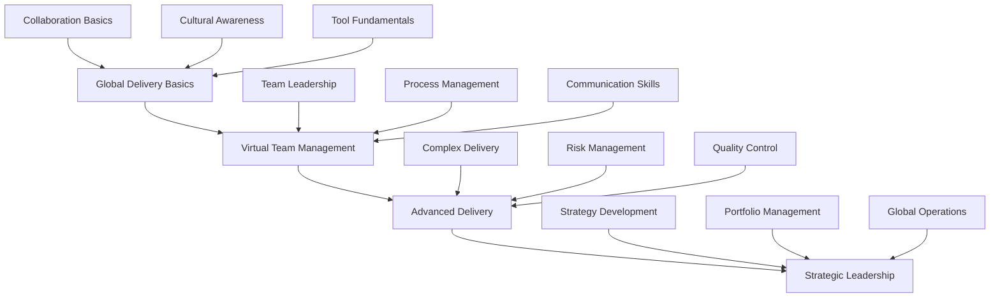

### 2. Training Components
- **Foundation Modules**
  - Global Delivery Fundamentals
  - Cross-cultural Communication
  - Virtual Collaboration Tools
  - Time Zone Management

- **Advanced Modules**
  - Distributed Leadership
  - Virtual Team Building
  - Global Resource Management
  - Risk Mitigation

- **Certification Path**
  - Level 1: Global Delivery Associate
  - Level 2: Virtual Team Lead
  - Level 3: Delivery Expert
  - Level 4: Global Delivery Strategist

### 3. Implementation Assets
- **Templates**
  - Team Structure Models
  - Communication Plans
  - Escalation Matrices
  - Performance Metrics

- **Tools & Accelerators**
  - Collaboration Platforms
  - Progress Tracking Tools
  - Resource Management Systems
  - Quality Dashboards

### 4. Knowledge Repository
- **Case Studies**
  - Global Team Success Stories
  - Challenges Overcome
  - Implementation Examples
  - Cultural Integration Stories

- **Reference Materials**
  - Best Practice Guides
  - Tool Usage Guides
  - Process Templates
  - Governance Frameworks

# Offering 3: Intelligent Accountability Framework
## Enabling Assets Framework

### 1. Learning Path Structure
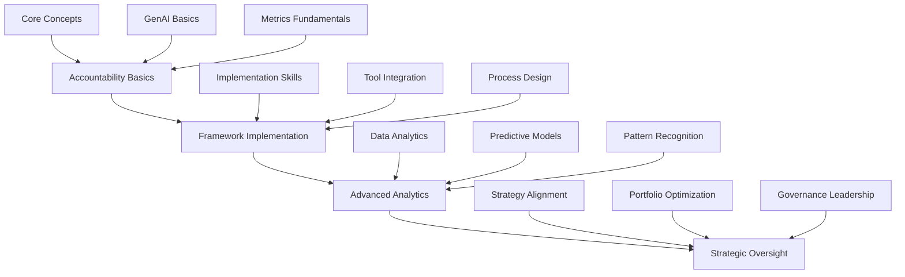

### 2. Training Components
- **Foundation Modules**
  - Accountability Principles
  - GenAI in Governance
  - Metrics & KPIs
  - Tool Fundamentals

- **Advanced Modules**
  - Advanced Analytics
  - Predictive Modeling
  - Risk Management
  - Performance Optimization

- **Certification Path**
  - Level 1: Accountability Associate
  - Level 2: Framework Practitioner
  - Level 3: Analytics Expert
  - Level 4: Governance Leader

### 3. Implementation Assets
- **Templates**
  - Accountability Matrices
  - Metric Definitions
  - Dashboard Templates
  - Risk Assessment Forms

- **Tools & Accelerators**
  - Analytics Platforms
  - Reporting Tools
  - GenAI Models
  - Automation Scripts

### 4. Knowledge Repository
- **Case Studies**
  - Implementation Success Stories
  - Analytics Use Cases
  - Transformation Examples
  - Risk Mitigation Stories

- **Reference Materials**
  - Framework Guides
  - Tool Configuration Guides
  - Best Practices
  - Governance Models

# Offering 4: Continuous Improvement Accelerator
## Enabling Assets Framework

### 1. Learning Path Structure
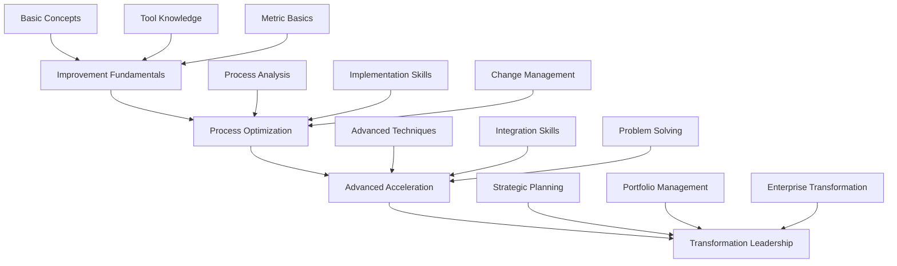

### 2. Training Components
- **Foundation Modules**
  - Improvement Methodologies
  - Process Analysis
  - Tool Fundamentals
  - Change Management

- **Advanced Modules**
  - Advanced Process Optimization
  - Integration Techniques
  - Performance Engineering
  - Transformation Strategy

- **Certification Path**
  - Level 1: Improvement Associate
  - Level 2: Process Optimizer
  - Level 3: Acceleration Expert
  - Level 4: Transformation Leader

### 3. Implementation Assets
- **Templates**
  - Process Analysis Tools
  - Improvement Plans
  - Measurement Systems
  - Implementation Guides

- **Tools & Accelerators**
  - Process Mining Tools
  - Automation Frameworks
  - Performance Dashboards
  - Analysis Templates

### 4. Knowledge Repository
- **Case Studies**
  - Optimization Success Stories
  - Implementation Examples
  - Transformation Results
  - Lessons Learned

- **Reference Materials**
  - Methodology Guides
  - Tool Usage Guidelines
  - Best Practices
  - Framework Documentation

# Offering 5: Meaningful Reinvention Framework
## Enabling Assets Framework

### 1. Learning Path Structure
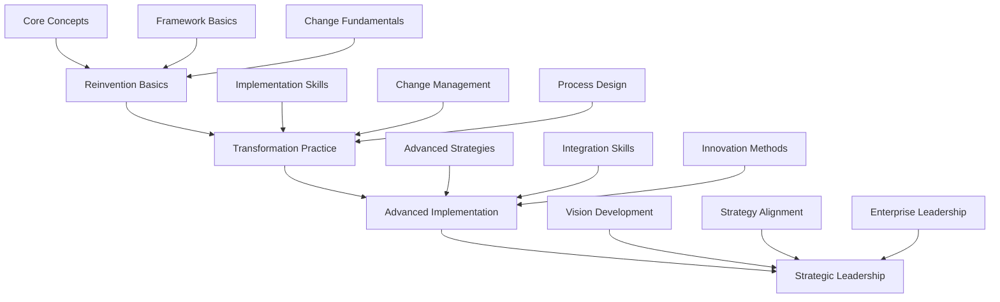

### 2. Training Components
- **Foundation Modules**
  - Reinvention Principles
  - Change Management
  - Stakeholder Management
  - Innovation Methods

- **Advanced Modules**
  - Transformation Strategy
  - Cultural Change
  - Value Creation
  - Strategic Alignment

- **Certification Path**
  - Level 1: Reinvention Associate
  - Level 2: Transformation Practitioner
  - Level 3: Innovation Expert
  - Level 4: Strategic Leader

### 3. Implementation Assets
- **Templates**
  - Assessment Tools
  - Transformation Plans
  - Change Roadmaps
  - Value Maps

- **Tools & Accelerators**
  - Strategy Planning Tools
  - Change Management Frameworks
  - Impact Assessment Tools
  - Progress Tracking Systems

### 4. Knowledge Repository
- **Case Studies**
  - Transformation Stories
  - Innovation Examples
  - Change Success Stories
  - Value Creation Examples

- **Reference Materials**
  - Framework Documentation
  - Implementation Guides
  - Best Practices
  - Leadership Guides

## Integration Between Offerings
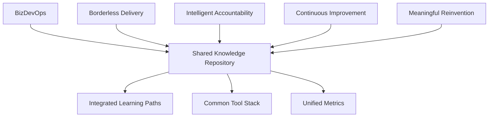

# Borderless Delivery Model - Detailed Framework

## 1. Learning Path Structure

### Foundation Level: Global Delivery Basics (4-6 weeks)
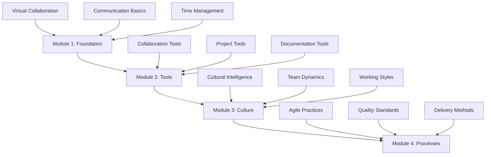

### Practitioner Level: Virtual Team Management (8-10 weeks)
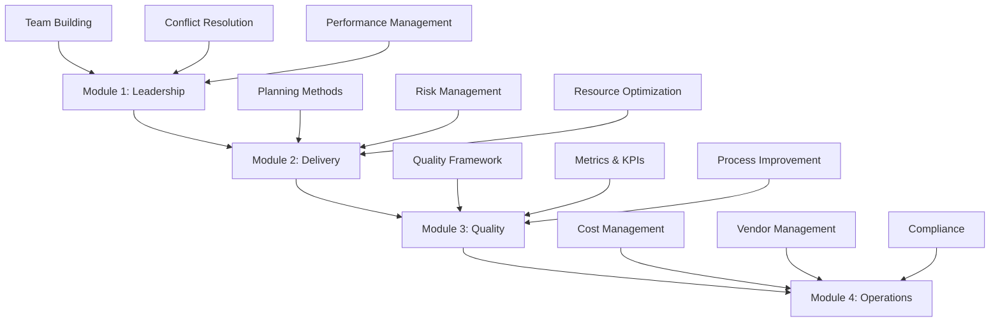

## 2. Detailed Training Components

### Foundation Modules

#### Module 1: Global Delivery Fundamentals
- **Topics Covered**:
  - Virtual collaboration principles
  - Time zone management
  - Communication protocols
  - Basic team dynamics

- **Learning Outcomes**:
  - Set up effective virtual meetings
  - Manage time zone differences
  - Use basic collaboration tools
  - Follow communication protocols

#### Module 2: Cross-cultural Communication
- **Topics Covered**:
  - Cultural awareness
  - Communication styles
  - Non-verbal communication
  - Building trust remotely

- **Learning Outcomes**:
  - Navigate cultural differences
  - Adapt communication styles
  - Build virtual relationships
  - Manage cultural sensitivities

#### Module 3: Virtual Collaboration Tools
- **Tools Covered**:
  - Microsoft Teams/Zoom
  - Jira/Azure DevOps
  - Confluence/SharePoint
  - Miro/Mural

- **Learning Outcomes**:
  - Proficient tool usage
  - Document management
  - Virtual whiteboarding
  - Collaboration best practices

### Advanced Modules

#### Module 1: Distributed Leadership
- **Topics Covered**:
  - Remote team leadership
  - Virtual motivation techniques
  - Performance management
  - Conflict resolution

- **Learning Outcomes**:
  - Lead virtual teams effectively
  - Manage remote performance
  - Handle virtual conflicts
  - Drive team engagement

## 3. Implementation Assets

### Assessment Tools
1. **Team Readiness Assessment**
   - Cultural readiness
   - Technical readiness
   - Process readiness
   - Tool readiness

2. **Individual Competency Assessment**
   - Communication skills
   - Technical skills
   - Leadership capabilities
   - Cultural adaptability

### Templates & Frameworks

1. **Communication Templates**
```markdown
# Daily Standup Template
- Date:
- Time Zone References:
- Attendees:

## Updates
1. Completed Items:
2. In Progress:
3. Blockers:
4. Support Needed:

## Action Items
1. [Action] - [Owner] - [Due Date]
```

2. **Planning Templates**
```markdown
# Sprint Planning Checklist
□ Time zones confirmed
□ All team members available
□ Tools tested
□ Pre-reading materials shared
□ Agenda distributed
□ Backup communication channel ready
```

3. **Performance Metrics Framework**
```markdown
# Team Performance Metrics
1. Delivery Metrics
   - Velocity
   - Quality metrics
   - Time zone efficiency

2. Collaboration Metrics
   - Meeting effectiveness
   - Communication clarity
   - Tool usage efficiency
```

## 4. Tool Stack & Integration

### Collaboration Layer
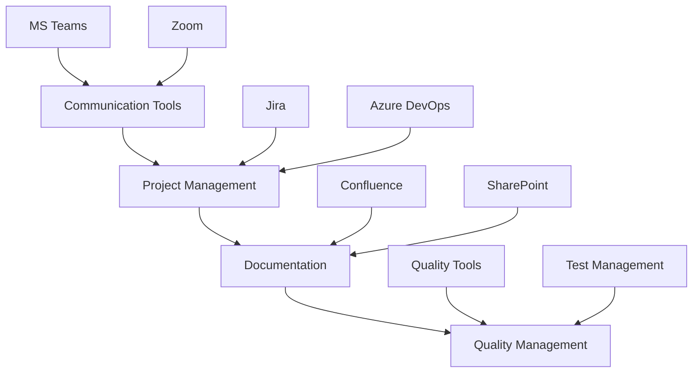

## 5. Best Practices Repository

### Communication Practices
1. **Asynchronous Communication**
   - Guidelines for emails
   - Documentation standards
   - Update protocols
   - Response expectations

2. **Synchronous Communication**
   - Meeting protocols
   - Virtual session guidelines
   - Time zone considerations
   - Recording standards

### Team Management Practices
1. **Virtual Team Building**
   - Regular social activities
   - Cultural exchange sessions
   - Virtual team building exercises
   - Recognition programs

2. **Performance Management**
   - Goal setting frameworks
   - Review processes
   - Feedback mechanisms
   - Recognition systems

## 6. Certification Requirements

### Level 1: Global Delivery Associate
- Complete foundation modules
- Pass theoretical assessment
- Complete virtual collaboration project
- Submit case study analysis

### Level 2: Virtual Team Lead
- 1 year practical experience
- Advanced module completion
- Team leadership project
- Mentoring experience

