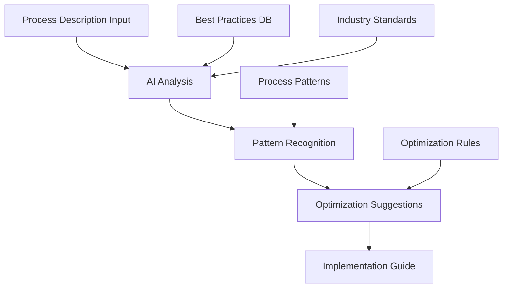
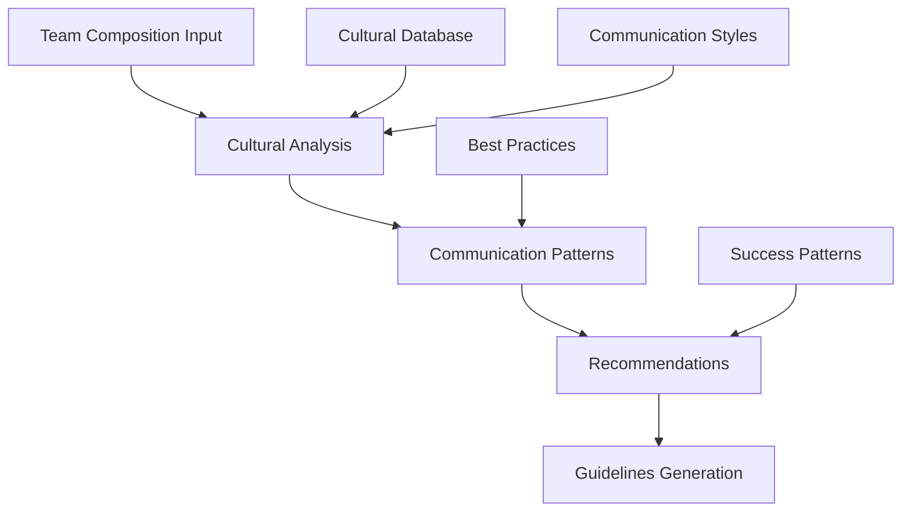
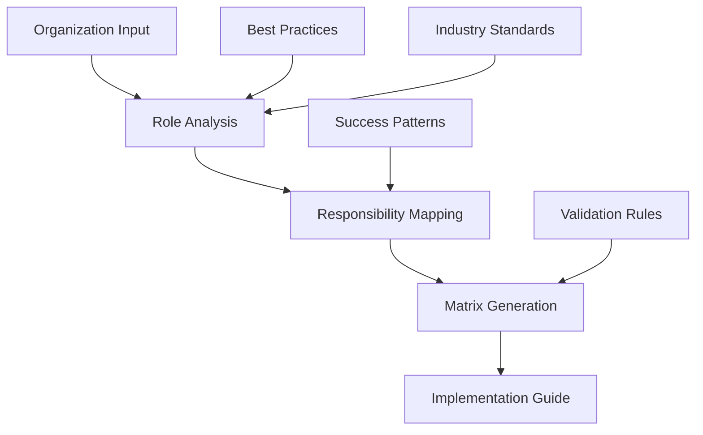
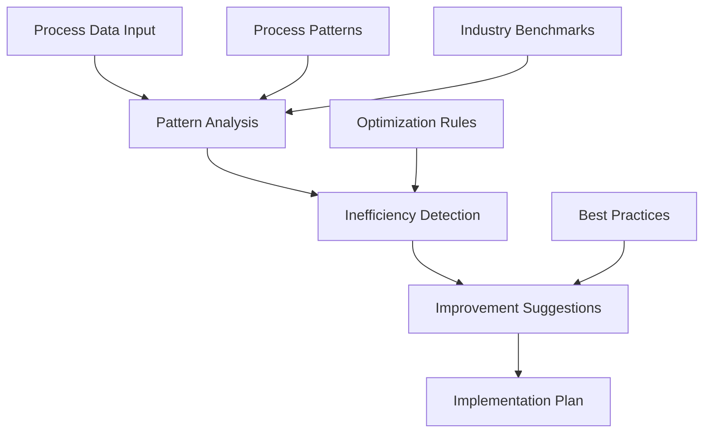
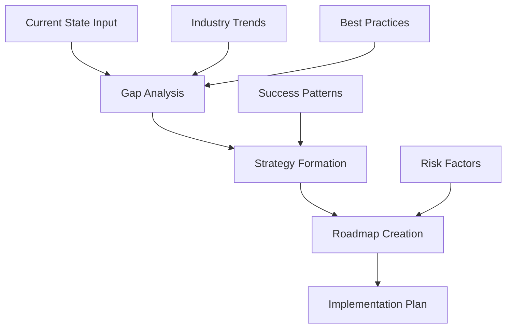
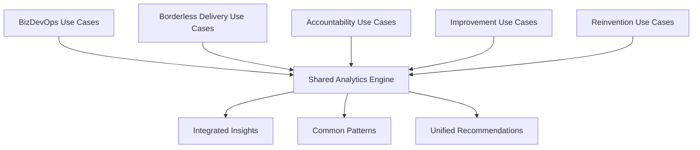
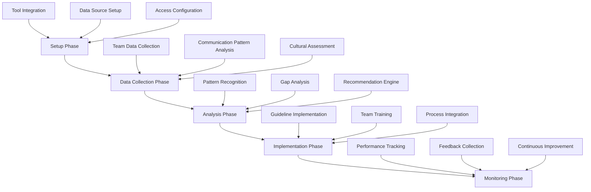
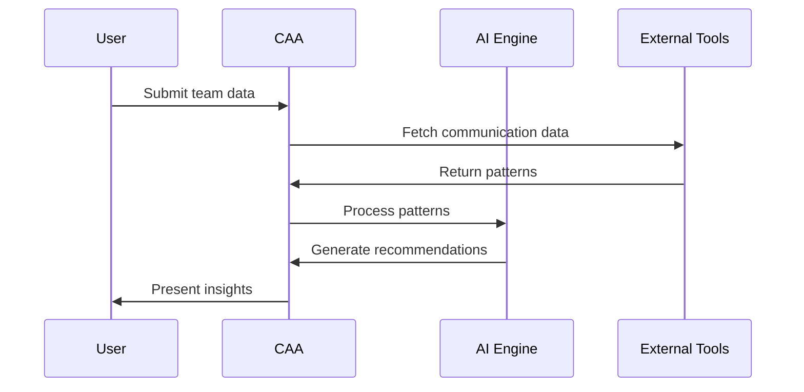
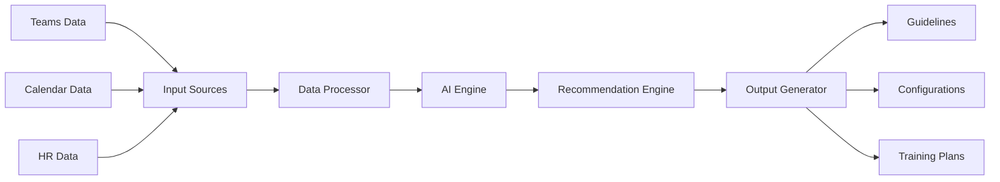

# GenAI Use Cases by Offering

## 1. BizDevOps Operating Model

### 1.1 Process Analysis Assistant
**Purpose**: Analyze and optimize BizDevOps processes using natural language inputs


**Features**:
- Natural language process description analysis
- Bottleneck identification
- Automation opportunity detection
- Integration point recommendations
- ROI calculation

### 1.2 Integration Pattern Generator
**Purpose**: Generate integration patterns between business and IT systems
- Pattern library utilization
- Custom pattern generation
- Implementation guidelines
- Risk assessment
- Cost estimation

### 1.3 Automated Documentation Creator
**Purpose**: Create and maintain BizDevOps documentation
- Process documentation
- Integration specifications
- Training materials
- Implementation guides
- Troubleshooting guides

### 1.4 Metrics Dashboard Generator
**Purpose**: Create custom metrics dashboards based on requirements
- KPI recommendation
- Visualization suggestions
- Data source mapping
- Alert configuration
- Trend analysis

### 1.5 Role Definition Generator
**Purpose**: Generate role definitions and RACI matrices
- Responsibility mapping
- Skill requirement definition
- Training plan creation
- Career path mapping
- Performance metrics

## 2. Borderless Delivery Model

### 2.1 Cultural Adaptation Assistant
**Purpose**: Provide cultural insights and communication recommendations


**Features**:
- Communication style analysis
- Cultural norm identification
- Meeting time optimization
- Collaboration recommendations
- Conflict resolution guidance

### 2.2 Virtual Team Optimizer
**Purpose**: Optimize virtual team structures and operations
- Team composition recommendations
- Time zone optimization
- Communication pattern analysis
- Tool stack recommendations
- Performance metric tracking

### 2.3 Knowledge Transfer Assistant
**Purpose**: Facilitate knowledge transfer across distributed teams
- Documentation generation
- Training material creation
- Best practice identification
- Success pattern recognition
- Learning path generation

### 2.4 Resource Allocation Assistant
**Purpose**: Optimize resource allocation across global teams
- Skill mapping
- Availability analysis
- Time zone optimization
- Cost optimization
- Performance prediction

### 2.5 Communication Template Generator
**Purpose**: Generate context-aware communication templates
- Meeting agendas
- Status reports
- Issue escalations
- Team updates
- Client communications

I'll continue with the remaining offerings following the same structured format.

## 3. Intelligent Accountability Framework

### 3.1 Accountability Matrix Generator
**Purpose**: Create and maintain dynamic accountability frameworks


**Features**:
- Role-based responsibility mapping
- Decision framework generation
- Escalation path definition
- KPI alignment
- Audit trail creation

### 3.2 Performance Predictor
**Purpose**: Predict performance outcomes using historical data
- Trend analysis
- Risk prediction
- Performance bottleneck identification
- Improvement recommendations
- Success pattern recognition

### 3.3 Automated Governance Reporter
**Purpose**: Generate comprehensive governance reports
- Status report generation
- Compliance checking
- Risk assessment
- Action item tracking
- Decision logging

### 3.4 Risk Assessment Engine
**Purpose**: Identify and analyze potential risks
- Risk pattern recognition
- Impact assessment
- Mitigation strategy suggestion
- Monitoring plan creation
- Early warning system

### 3.5 Decision Support Assistant
**Purpose**: Provide data-driven decision support
- Data analysis
- Option evaluation
- Impact assessment
- Recommendation generation
- Decision documentation

## 4. Continuous Improvement Accelerator

### 4.1 Process Mining Assistant


**Features**:
- Process pattern recognition
- Bottleneck identification
- Optimization opportunities
- ROI calculation
- Implementation roadmap

### 4.2 Improvement Opportunity Detector
**Purpose**: Identify and prioritize improvement opportunities
- Performance analysis
- Cost impact assessment
- Effort estimation
- Priority recommendation
- Implementation planning

### 4.3 Automation Opportunity Finder
**Purpose**: Identify potential automation candidates
- Task analysis
- ROI calculation
- Technology recommendation
- Implementation complexity assessment
- Risk evaluation

### 4.4 KPI Recommendation Engine
**Purpose**: Suggest and track improvement metrics
- Metric recommendation
- Benchmark analysis
- Target setting
- Progress tracking
- Impact assessment

### 4.5 Change Impact Analyzer
**Purpose**: Assess impact of proposed changes
- Dependency analysis
- Stakeholder impact
- Risk assessment
- Resource requirement
- Timeline prediction

## 5. Meaningful Reinvention Framework

### 5.1 Transformation Roadmap Generator


**Features**:
- Current state analysis
- Future state visualization
- Gap identification
- Initiative prioritization
- Timeline generation

### 5.2 Change Readiness Assessor
**Purpose**: Evaluate organizational change readiness
- Culture assessment
- Capability evaluation
- Resource assessment
- Risk identification
- Readiness scoring

### 5.3 Value Stream Optimizer
**Purpose**: Optimize value delivery streams
- Value stream mapping
- Waste identification
- Optimization suggestions
- Implementation planning
- ROI calculation

### 5.4 Innovation Pattern Generator
**Purpose**: Generate innovation opportunities
- Trend analysis
- Pattern recognition
- Opportunity identification
- Impact assessment
- Implementation roadmap

### 5.5 Cultural Transformation Assistant
**Purpose**: Guide cultural transformation initiatives
- Cultural assessment
- Change strategy
- Communication planning
- Training recommendation
- Progress tracking

## Cross-Offering Integration


I'll create detailed specifications for two high-impact use cases that span multiple offerings. I'll focus on "Cultural Adaptation Assistant" from Borderless Delivery Model and "Transformation Roadmap Generator" from Meaningful Reinvention Framework.

# 1. Cultural Adaptation Assistant (CAA)

## Detailed Implementation Steps


## Technical Specifications

### 1. System Architecture
```markdown
Frontend:
- React-based web interface
- Real-time updates using WebSocket
- Responsive design for multiple devices

Backend:
- Python/FastAPI backend
- MongoDB for data storage
- Redis for caching
- Azure OpenAI/GPT-4 integration

Integration Points:
- MS Teams/Slack API
- Calendar Systems
- Project Management Tools
- HR Systems
```

### 2. Data Model
```json
{
  "team": {
    "id": "string",
    "name": "string",
    "locations": ["string"],
    "timeZones": ["string"],
    "culturalFactors": [{
      "region": "string",
      "workingStyles": ["string"],
      "communicationPreferences": ["string"]
    }]
  },
  "communication_patterns": {
    "async_ratio": "float",
    "meeting_times": ["datetime"],
    "preferred_channels": ["string"],
    "response_times": "object"
  },
  "recommendations": {
    "meeting_schedule": "object",
    "communication_guidelines": ["string"],
    "tool_configurations": "object",
    "training_needs": ["string"]
  }
}
```

### 3. API Endpoints
```yaml
/api/v1/cultural-assessment:
  post:
    description: Submit team data for analysis
    parameters:
      - team_data: object
    returns:
      - assessment_id: string

/api/v1/recommendations:
  get:
    description: Get cultural recommendations
    parameters:
      - assessment_id: string
    returns:
      - recommendations: object
```

## Integration Patterns

### 1. Tool Integration Flow


### 2. Data Flow


## Sample Prompts and Outputs

### 1. Team Analysis Prompt
```markdown
Analyze team composition and generate cultural adaptation recommendations:
- Team Size: 12
- Locations: India, US, UK
- Working Hours: IST(9-6), EST(9-5), GMT(9-5)
- Experience Levels: Junior(4), Mid(6), Senior(2)
- Current Challenges: Meeting scheduling, Communication delays
```

### 2. AI Response
```markdown
Cultural Adaptation Recommendations:

1. Meeting Schedule:
   - Core collaboration hours: 13:30-15:30 GMT
   - Rotate meeting times to share burden
   - Record all meetings for async viewing

2. Communication Guidelines:
   - Use asynchronous updates for non-urgent matters
   - Set up "buddy system" across time zones
   - Implement "golden hour" for cross-team collaboration

3. Tool Configurations:
   - Configure Teams for automatic time zone display
   - Set up shared documentation in Confluence
   - Implement async status update system

4. Training Needs:
   - Cultural awareness workshop
   - Effective async communication
   - Time management across zones

5. Team Building Activities:
   - Virtual coffee chats
   - Cultural exchange sessions
   - Shared virtual activities
```
