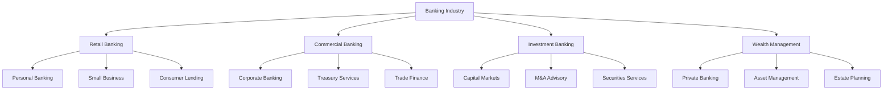
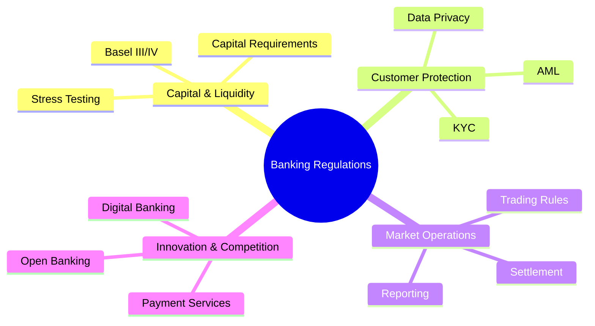
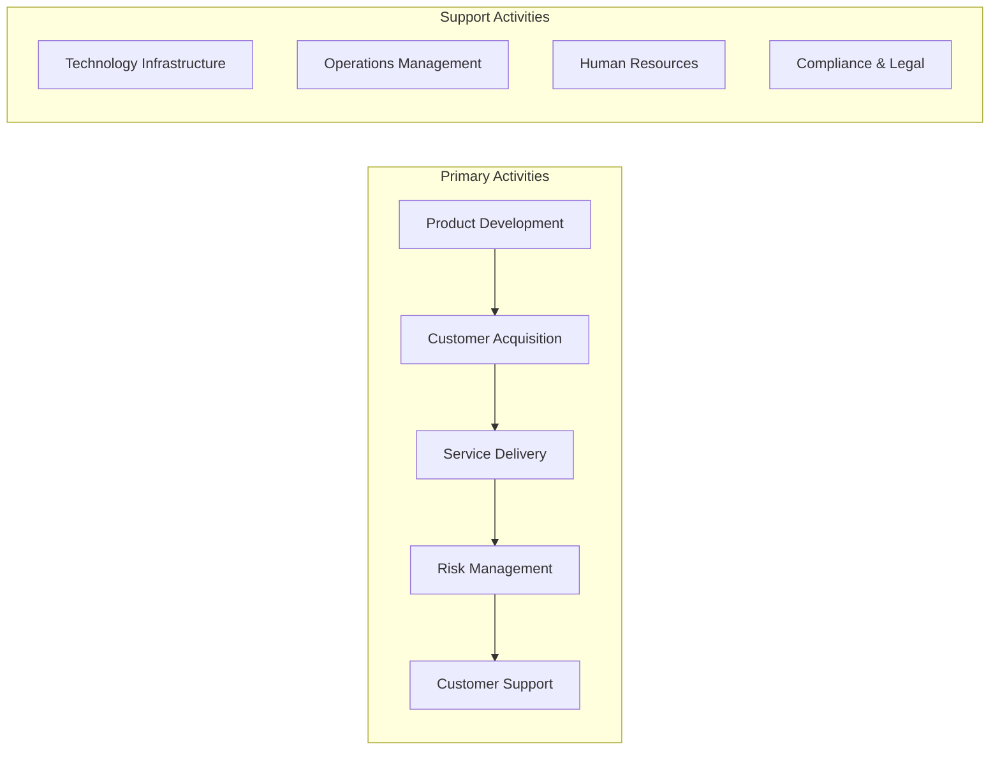
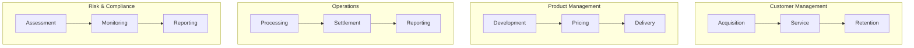
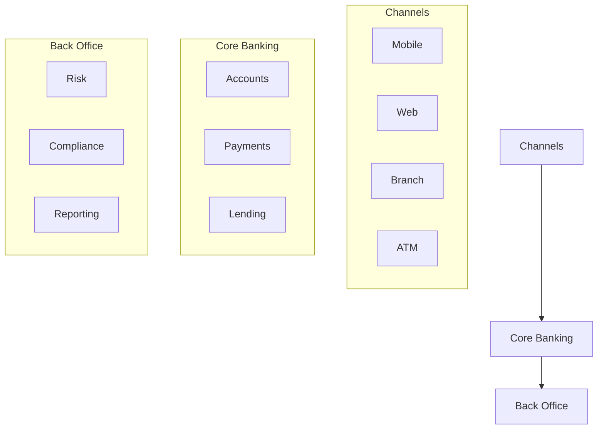
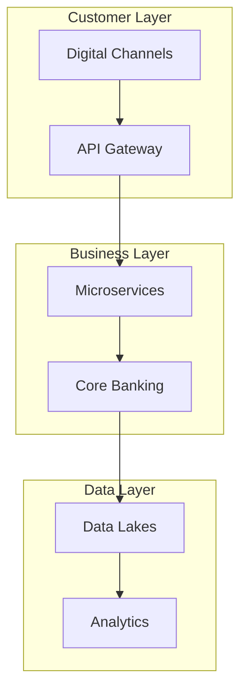
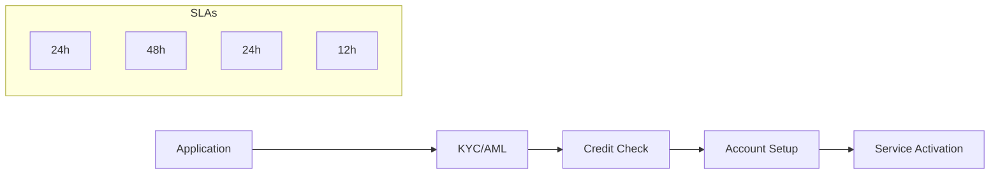
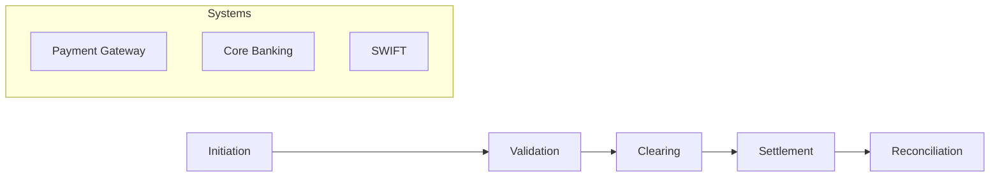
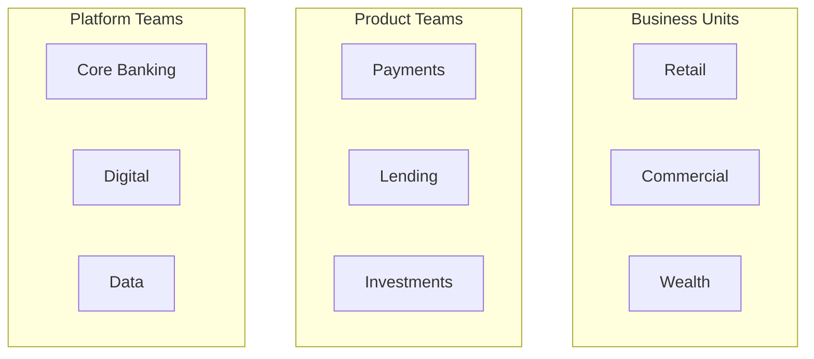
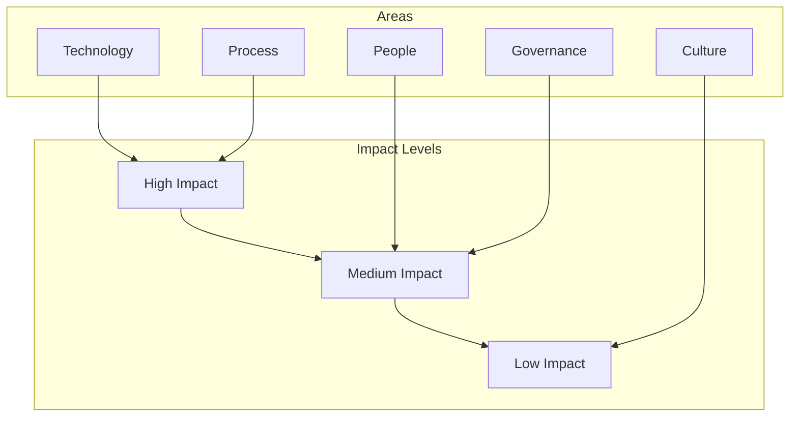

# Banking Industry Document - Visualization Guide

## 1. Industry Overview Visuals

### Market Landscape

### Regulatory Framework

## 2. Business Architecture Visuals

### Value Chain

### Business Capabilities Map

## 3. Technology Landscape Visuals

### System Architecture

### Digital Banking Stack

## 4. Value Streams Visuals

### Customer Onboarding Value Stream

### Payment Processing Value Stream

## 5. Transformation Context Visuals

### Agile Organization Structure

### Change Impact Heat Map

