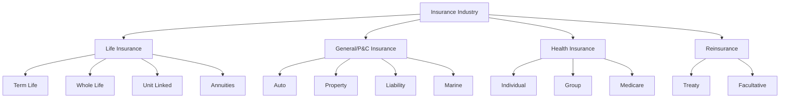
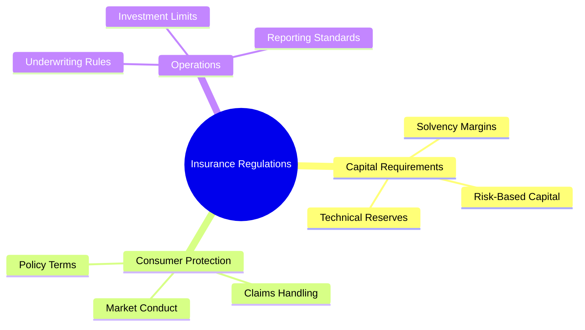
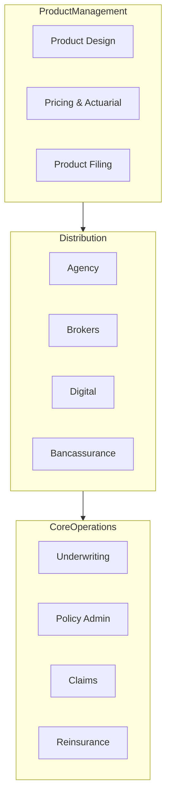
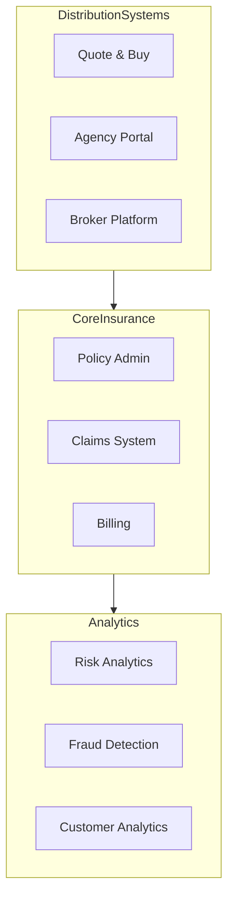
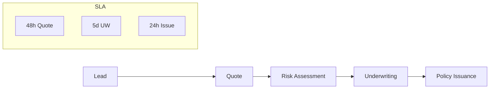
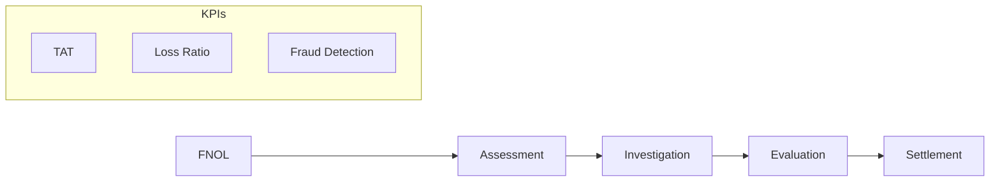
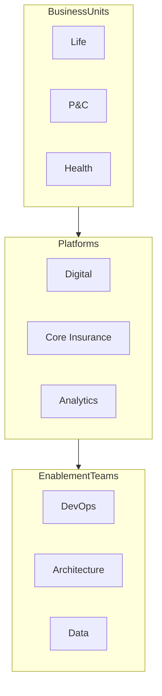
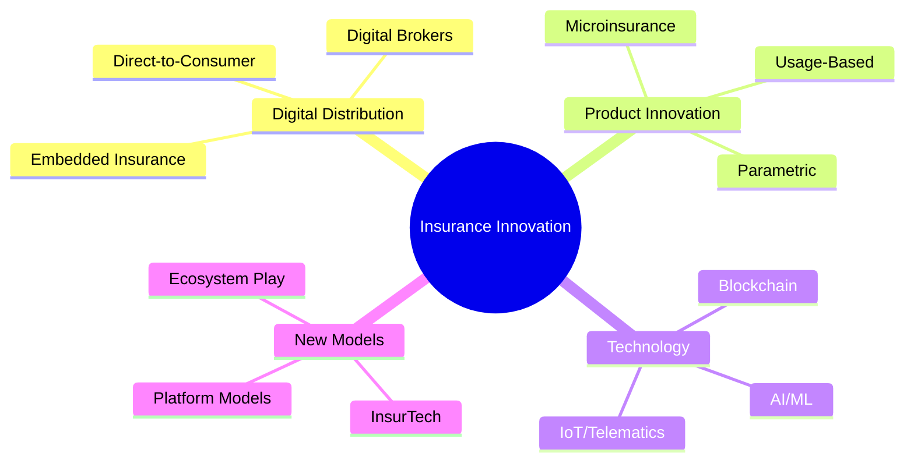
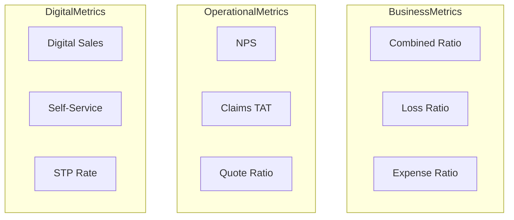

# Insurance Industry Knowledge Document

## 1. Industry Overview

### Market Structure

### Regulatory Framework

## 2. Core Business Capabilities

## 3. Insurance Value Chain

```mermaid
flowchart LR
    subgraph Frontend
        direction TB
        F1[Product Development]
        F2[Marketing]
        F3[Distribution]
        F4[Sales]
    end
    
    subgraph Core
        direction TB
        C1[Risk Assessment]
        C2[Underwriting]
        C3[Policy Issuance]
        C4[Claims Management]
    end
    
    subgraph Backend
        direction TB
        B1[Investment Management]
        B2[Reinsurance]
        B3[Finance & Actuarial]
        B4[Risk Management]
    end
    
    Frontend --> Core
    Core --> Backend
```

## 4. Technology Landscape

### System Architecture

## 5. Key Business Processes

### New Business Process

### Claims Process

## 6. Agile Transformation Context

### Common Organizational Structure

## 7. Industry Trends and Disruption

## Reference Information

### Key Industry Standards
1. Accounting Standards
   - IFRS 17/9
   - Statutory Reporting
   - GAAP

2. Data Standards
   - ACORD
   - ISO
   - NAIC

3. Key Metrics
