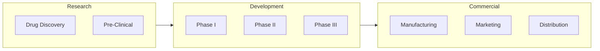
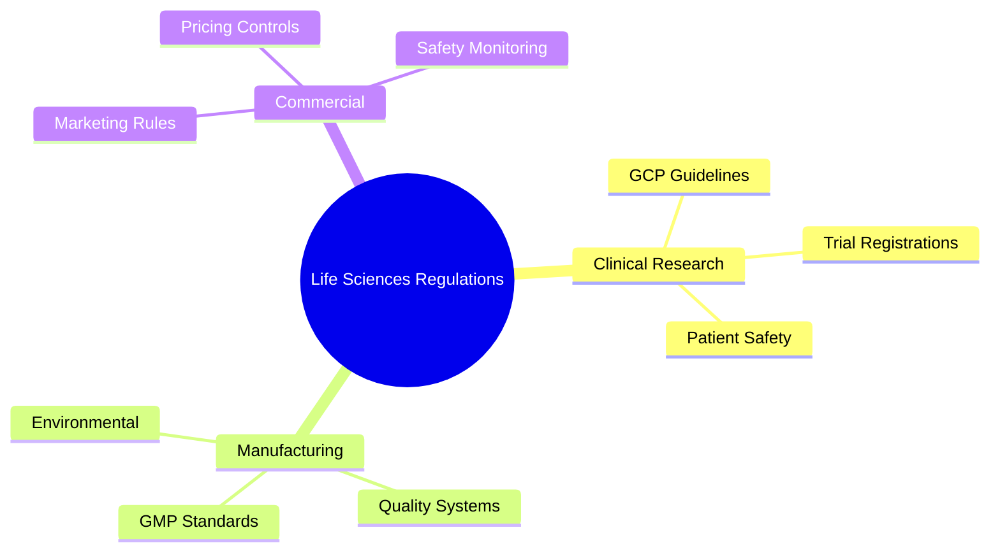
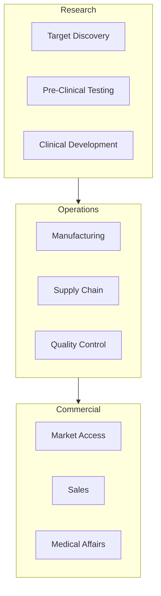
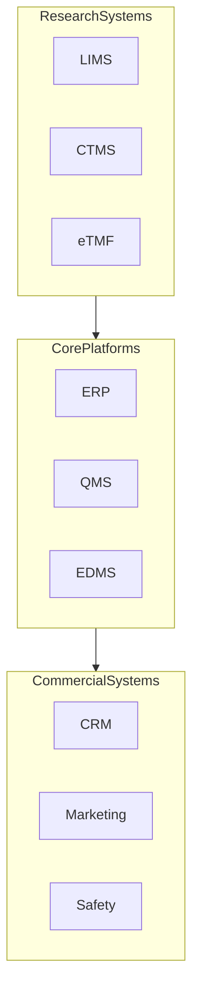
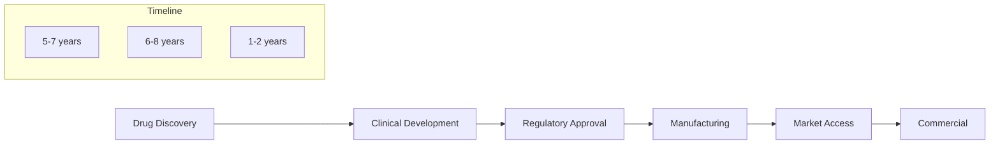
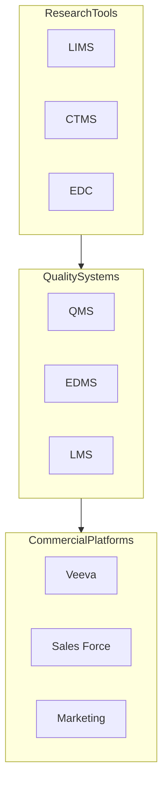

# Life Sciences Industry Knowledge Document

## 1. Industry Overview

### Market Landscape
- Global life sciences market: $2+ trillion
- Key segments: Pharmaceuticals, Biotechnology, Medical Devices, Research & Development
- Major players: Big Pharma (Pfizer, Roche), Biotech (Amgen, Gilead), Device Manufacturers (Medtronic, Abbott)
- Rise of personalized medicine and digital therapeutics
- Growth in biosimilars and specialty medicines

### Value Chain Visualization

### Regulatory Environment

### Industry Challenges
- Long development cycles
- High R&D costs
- Regulatory compliance
- Patent cliffs
- Access to talent
- Digital transformation needs
- Data management complexity
- Market access hurdles

## 2. Business Architecture

### Core Business Capabilities

### Detailed Capabilities
L1 Capabilities:
1. Research & Development
   - Drug Discovery
   - Pre-clinical Research
   - Clinical Development
   - Regulatory Affairs
   
2. Manufacturing & Supply Chain
   - Process Development
   - Quality Management
   - Supply Planning
   - Distribution

3. Commercial Operations
   - Market Access
   - Sales & Marketing
   - Medical Affairs
   - Patient Support

4. Support Functions
   - Regulatory Compliance
   - Quality Assurance
   - Pharmacovigilance
   - Data Management

### Operating Model
Typical Structures:
- Therapeutic Area-based
- Geography-based
- Function-based (R&D, Commercial, Manufacturing)
- Matrix organizations
- Center of Excellence models

## 3. Technology Landscape

### Core Systems

### Common Platforms
1. Research & Development
   - LIMS (Laboratory Information Management)
   - CTMS (Clinical Trial Management)
   - EDC (Electronic Data Capture)
   - eTMF (Electronic Trial Master File)

2. Manufacturing & Quality
   - ERP Systems (SAP, Oracle)
   - QMS (Quality Management)
   - MES (Manufacturing Execution)
   - LIMS (Lab Information Management)

3. Commercial Operations
   - Veeva CRM
   - Marketing Automation
   - Safety/Pharmacovigilance
   - Market Access Platforms

### Technology Trends
- AI/ML in drug discovery
- Real-world evidence platforms
- Digital clinical trials
- Blockchain for supply chain
- Digital therapeutics
- Advanced analytics
- Cloud adoption

## 4. Value Streams & Processes

### Core Value Streams

### Key Processes
1. Drug Development Process
   - Target identification
   - Lead optimization
   - Pre-clinical testing
   - Clinical trials (Phase I-III)
   - Regulatory submission

2. Manufacturing Process
   - Process development
   - Scale-up
   - Validation
   - Commercial production
   - Quality control

3. Commercial Process
   - Market access
   - Launch planning
   - Sales execution
   - Medical affairs
   - Post-market surveillance

## 5. Agile Transformation Context

### Transformation Drivers
- Speed to market
- R&D efficiency
- Digital innovation
- Cost optimization
- Regulatory agility
- Patient centricity

### Common Patterns
1. Transformation Approach
   - Digital R&D
   - Agile clinical development
   - Digital manufacturing
   - Commercial excellence
   - Data-driven decision making

2. Organization Structure
   - Product teams
   - Development squads
   - Digital CoEs
   - Innovation hubs

## 6. Change Management Considerations

### Cultural Aspects
- Scientific rigor focus
- Regulatory mindset
- Innovation culture
- Risk management
- Quality focus
- Patient safety priority

### Stakeholder Management
Key Groups:
1. Internal
   - Scientific Leadership
   - R&D Teams
   - Manufacturing
   - Commercial Teams
   - Quality/Regulatory

2. External
   - Regulators (FDA, EMA)
   - Healthcare Providers
   - Patients
   - Payers
   - Research Partners

## 7. Reference Information

### Industry Standards
- GMP (Good Manufacturing Practice)
- GCP (Good Clinical Practice)
- ICH Guidelines
- ISO Standards
- Pharmacopeia Standards

### Key Frameworks
- Quality Management System
- Clinical Development Framework
- Regulatory Compliance Framework
- Commercial Excellence Model

### Metrics & KPIs
1. Research & Development
   - Pipeline Progress
   - Trial Success Rates
   - Time to Market
   - Patent Portfolio

2. Operations
   - Manufacturing Yield
   - Quality Metrics
   - Supply Reliability
   - Cost of Goods

3. Commercial
   - Market Share
   - Sales Growth
   - Market Access
   - Patient Reach

### Industry-Specific Systems

